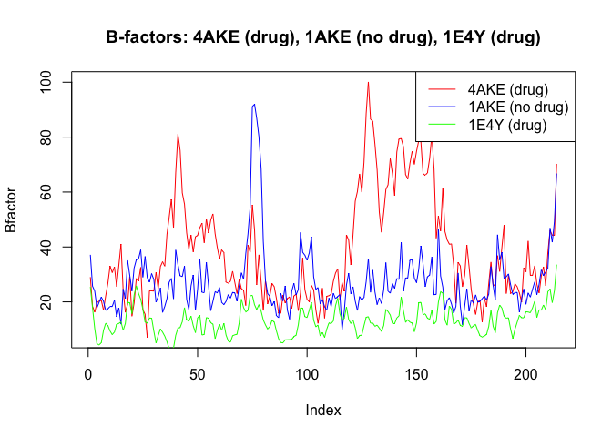
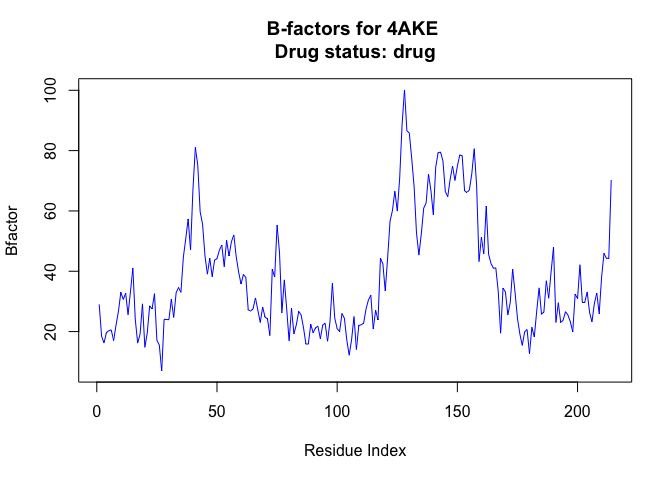

# HW Class6
Maria Tavares (A69036242)

To improve this function, first, I had to fix the line that says
“s3.chainA” to reflex s3 instead of s1.

``` r
# Can you improve this analysis code?
library(bio3d)
s1 <- read.pdb("4AKE") # kinase with drug
```

      Note: Accessing on-line PDB file

``` r
s2 <- read.pdb("1AKE") # kinase no drug
```

      Note: Accessing on-line PDB file
       PDB has ALT records, taking A only, rm.alt=TRUE

``` r
s3 <- read.pdb("1E4Y") # kinase with drug
```

      Note: Accessing on-line PDB file

``` r
s1.chainA <- trim.pdb(s1, chain="A", elety="CA")
s2.chainA <- trim.pdb(s2, chain="A", elety="CA")
s3.chainA <- trim.pdb(s3, chain="A", elety="CA")
s1.b <- s1.chainA$atom$b
s2.b <- s2.chainA$atom$b
s3.b <- s3.chainA$atom$b
plotb3(s1.b, sse=s1.chainA, typ="l", ylab="Bfactor")
```


``` r
plotb3(s2.b, sse=s2.chainA, typ="l", ylab="Bfactor")
```


``` r
plotb3(s3.b, sse=s3.chainA, typ="l", ylab="Bfactor")
```


Another and better way to visualize it would be to add it all to the
same plot and color it differently to help with assessing the difference
the conditions.

``` r
plot(s1.b, type="l", col="red", ylab="Bfactor", main="B-factors: 4AKE (drug), 1AKE (no drug), 1E4Y (drug)")
lines(s2.b, col="blue")
lines(s3.b, col="green")
legend("topright", legend=c("4AKE (drug)", "1AKE (no drug)", "1E4Y (drug)"), col=c("red", "blue", "green"), lty=1)
```



This would be another way showing one drug.

``` r
library(bio3d)

analyze_protein_drug <- function(pdb_id, drug_status = "unknown") {
  pdb <- read.pdb(pdb_id)
  chainA <- trim.pdb(pdb, chain="A", elety="CA")
  b_factors <- chainA$atom$b
  plot(
    b_factors,
    type = "l",
    col = "blue",
    ylab = "Bfactor",
    xlab = "Residue Index",
    main = paste("B-factors for", pdb_id, "\nDrug status:", drug_status)
  )
}
```

``` r
analyze_protein_drug("4AKE", "drug")
```

      Note: Accessing on-line PDB file

    Warning in get.pdb(file, path = tempdir(), verbose = FALSE):
    /var/folders/lm/h7tgm0452l50knhc4xstw41m0000gn/T//RtmpSm5Skx/4AKE.pdb exists.
    Skipping download


