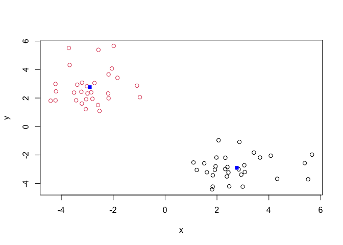
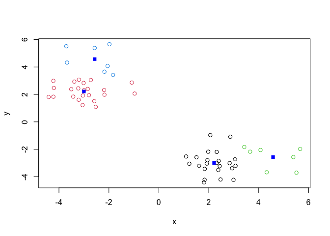
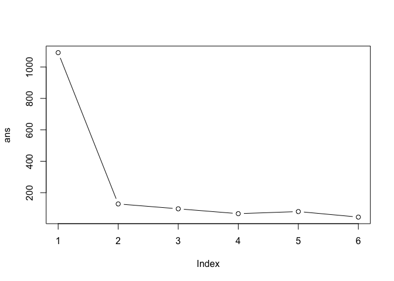
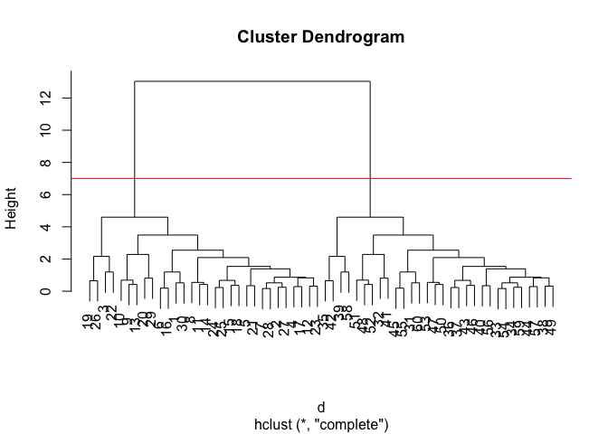
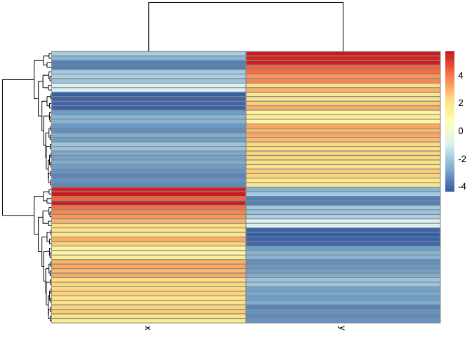
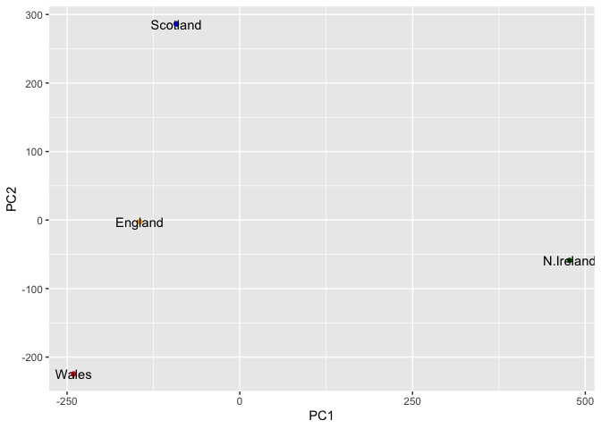

# Class 7: Machine Learning 1
Maria Tavares (A69036242)

Today we will begin exploration of some “classical” machine learning
approaches. We will start with clustering:

Let’s first make up some data to cluster where we know what the answer
should be.

``` r
hist( rnorm(1000) )
```


``` r
x <- c(rnorm(30, mean = -3), rnorm(30, mean = 3))
y <- rev(x)

x <- cbind(x,y)
head(x)
```

                 x        y
    [1,] -4.203207 2.472197
    [2,] -2.798888 1.946759
    [3,] -3.705062 5.512693
    [4,] -3.227023 2.440574
    [5,] -2.192656 2.321526
    [6,] -4.410509 1.812332

A wee peak at x with `plot()`

``` r
plot(x)
```


The main function in “base” R for K-means clustering is called
`kmeans()`.

``` r
k <- kmeans(x, centers = 2)
k
```

    K-means clustering with 2 clusters of sizes 30, 30

    Cluster means:
              x         y
    1  2.765044 -2.900303
    2 -2.900303  2.765044

    Clustering vector:
     [1] 2 2 2 2 2 2 2 2 2 2 2 2 2 2 2 2 2 2 2 2 2 2 2 2 2 2 2 2 2 2 1 1 1 1 1 1 1 1
    [39] 1 1 1 1 1 1 1 1 1 1 1 1 1 1 1 1 1 1 1 1 1 1

    Within cluster sum of squares by cluster:
    [1] 64.15192 64.15192
     (between_SS / total_SS =  88.2 %)

    Available components:

    [1] "cluster"      "centers"      "totss"        "withinss"     "tot.withinss"
    [6] "betweenss"    "size"         "iter"         "ifault"      

> Q. How big are the clusters(i.e their size)?

``` r
k$size
```

    [1] 30 30

> Q. What clusters do my data points reside in?

``` r
k$cluster
```

     [1] 2 2 2 2 2 2 2 2 2 2 2 2 2 2 2 2 2 2 2 2 2 2 2 2 2 2 2 2 2 2 1 1 1 1 1 1 1 1
    [39] 1 1 1 1 1 1 1 1 1 1 1 1 1 1 1 1 1 1 1 1 1 1

> Q. Make a plot of our data colored by cluster assignment - i.e make a
> result figure…

``` r
plot(x, col = k$cluster )
points(k$centers, col = "blue", pch = 15)
```



> Q. Now cluster with k-means into 4 clusters and plot your results.

``` r
k4 <- kmeans(x, centers = 4)
k4
```

    K-means clustering with 4 clusters of sizes 23, 23, 7, 7

    Cluster means:
              x         y
    1  2.213848 -3.000686
    2 -3.000686  2.213848
    3  4.576116 -2.570474
    4 -2.570474  4.576116

    Clustering vector:
     [1] 2 2 4 2 2 2 2 2 4 4 2 2 4 2 2 2 2 2 4 2 2 4 2 2 2 4 2 2 2 2 1 1 1 1 3 1 1 1
    [39] 3 1 1 3 1 1 1 1 1 3 1 1 3 3 1 1 1 1 1 3 1 1

    Within cluster sum of squares by cluster:
    [1] 24.183369 24.183369  9.027628  9.027628
     (between_SS / total_SS =  93.9 %)

    Available components:

    [1] "cluster"      "centers"      "totss"        "withinss"     "tot.withinss"
    [6] "betweenss"    "size"         "iter"         "ifault"      

``` r
plot(x, col = k4$cluster )
points(k4$centers, col = "blue", pch = 15)
```



> Q. Run k-means with center (i.e values of k) equal to 1 to 6

``` r
ans <- NULL
for (i in 1:6) {
  ans <- c(ans, kmeans(x, centers =i)$tot.withinss)
}
ans
```

    [1] 1091.18857  128.30383   97.36291   66.42199   79.86117   44.58627

``` r
plot(ans, typ="b")
```



## Hierarchical Clustering

The main function in “base” R for this is called `hclust()`

``` r
d <- dist(x)
hc <-hclust(d)
hc
```


    Call:
    hclust(d = d)

    Cluster method   : complete 
    Distance         : euclidean 
    Number of objects: 60 

``` r
plot(hc)
abline(h=7,col="red")
```



To obtain clusters from out `hclust` result object **hc** we “cut” the
tree to yield different sub branches. For this we use the `cutree()`
function

``` r
grps <- cutree(hc, h=7)
grps
```

     [1] 1 1 1 1 1 1 1 1 1 1 1 1 1 1 1 1 1 1 1 1 1 1 1 1 1 1 1 1 1 1 2 2 2 2 2 2 2 2
    [39] 2 2 2 2 2 2 2 2 2 2 2 2 2 2 2 2 2 2 2 2 2 2

``` r
plot(x, col = grps)
```


``` r
library(pheatmap)

pheatmap(x)
```



## Principal Component Analysis (PCA)

``` r
url <- "https://tinyurl.com/UK-foods"
x <- read.csv(url)
```

> Q1. How many rows and columns are in your new data frame named x? What
> R functions could you use to answer this questions?

``` r
dim(x)
```

    [1] 17  5

``` r
head(x)
```

                   X England Wales Scotland N.Ireland
    1         Cheese     105   103      103        66
    2  Carcass_meat      245   227      242       267
    3    Other_meat      685   803      750       586
    4           Fish     147   160      122        93
    5 Fats_and_oils      193   235      184       209
    6         Sugars     156   175      147       139

``` r
# Note how the minus indexing works
rownames(x) <- x[,1]
x <- x[,-1]
head(x)
```

                   England Wales Scotland N.Ireland
    Cheese             105   103      103        66
    Carcass_meat       245   227      242       267
    Other_meat         685   803      750       586
    Fish               147   160      122        93
    Fats_and_oils      193   235      184       209
    Sugars             156   175      147       139

``` r
dim(x)
```

    [1] 17  4

``` r
x <- read.csv(url, row.names=1)
head(x)
```

                   England Wales Scotland N.Ireland
    Cheese             105   103      103        66
    Carcass_meat       245   227      242       267
    Other_meat         685   803      750       586
    Fish               147   160      122        93
    Fats_and_oils      193   235      184       209
    Sugars             156   175      147       139

> Q2. Which approach to solving the ‘row-names problem’ mentioned above
> do you prefer and why? Is one approach more robust than another under
> certain circumstances?

The second one because running the first one multiple times would get
keep getting rid of columns.

### Spotting major differences and trends

``` r
rainbow(nrow(x))
```

     [1] "#FF0000" "#FF5A00" "#FFB400" "#F0FF00" "#96FF00" "#3CFF00" "#00FF1E"
     [8] "#00FF78" "#00FFD2" "#00D2FF" "#0078FF" "#001EFF" "#3C00FF" "#9600FF"
    [15] "#F000FF" "#FF00B4" "#FF005A"

``` r
barplot(as.matrix(x), beside=T, col=rainbow(nrow(x)))
```


> Q3: Changing what optional argument in the above barplot() function
> results in the following plot?

Setting beside argument to FALSE (or removing it cause the default is
fault)

``` r
barplot(as.matrix(x), col=rainbow(nrow(x)))
```


Now using GG plot

``` r
library(tidyr)

# Convert data to long format for ggplot with `pivot_longer()`
x_long <- x |> 
          tibble::rownames_to_column("Food") |> 
          pivot_longer(cols = -Food, 
                       names_to = "Country", 
                       values_to = "Consumption")

dim(x_long)
```

    [1] 68  3

``` r
head(x_long)
```

    # A tibble: 6 × 3
      Food            Country   Consumption
      <chr>           <chr>           <int>
    1 "Cheese"        England           105
    2 "Cheese"        Wales             103
    3 "Cheese"        Scotland          103
    4 "Cheese"        N.Ireland          66
    5 "Carcass_meat " England           245
    6 "Carcass_meat " Wales             227

``` r
library(ggplot2)

ggplot(x_long) +
  aes(x = Country, y = Consumption, fill = Food) +
  geom_col(position = "dodge") +
  theme_bw()
```


> Q4: Changing what optional argument in the above ggplot() code results
> in a stacked barplot figure?

\##Pairs plots and heatmaps

> Q5: We can use the pairs() function to generate all pairwise plots for
> our countries. Can you make sense of the following code and resulting
> figure? What does it mean if a given point lies on the diagonal for a
> given plot?

Away from the diagonal means more dissimilar.

``` r
pairs(x, col=rainbow(nrow(x)), pch=16)
```


``` r
library(pheatmap)

pheatmap( as.matrix(x) )
```


> Q6. Based on the pairs and heatmap figures, which countries cluster
> together and what does this suggest about their food consumption
> patterns? Can you easily tell what the main differences between N.
> Ireland and the other countries of the UK in terms of this data-set?

You can infer Wales and England are similar in their food consumption.
N. Ireland is more dissimilar but you can’t draw many conclusions by
just looking at the heatmap.

## PCA to the rescue

The main function in “base” R for PCA is called `prcomp()`.

As we want to do PCA on the food data for the different countries we
will want the foods in the columns.

``` r
t(x)
```

              Cheese Carcass_meat  Other_meat  Fish Fats_and_oils  Sugars
    England      105           245         685  147            193    156
    Wales        103           227         803  160            235    175
    Scotland     103           242         750  122            184    147
    N.Ireland     66           267         586   93            209    139
              Fresh_potatoes  Fresh_Veg  Other_Veg  Processed_potatoes 
    England               720        253        488                 198
    Wales                 874        265        570                 203
    Scotland              566        171        418                 220
    N.Ireland            1033        143        355                 187
              Processed_Veg  Fresh_fruit  Cereals  Beverages Soft_drinks 
    England              360         1102     1472        57         1374
    Wales                365         1137     1582        73         1256
    Scotland             337          957     1462        53         1572
    N.Ireland            334          674     1494        47         1506
              Alcoholic_drinks  Confectionery 
    England                 375             54
    Wales                   475             64
    Scotland                458             62
    N.Ireland               135             41

``` r
pca <- prcomp( t(x) )
summary(pca)
```

    Importance of components:
                                PC1      PC2      PC3       PC4
    Standard deviation     324.1502 212.7478 73.87622 2.921e-14
    Proportion of Variance   0.6744   0.2905  0.03503 0.000e+00
    Cumulative Proportion    0.6744   0.9650  1.00000 1.000e+00

Our result object is called `pca`and it has a `$x` component that we
will look at first.

``` r
pca$x
```

                     PC1         PC2        PC3           PC4
    England   -144.99315   -2.532999 105.768945 -9.152022e-15
    Wales     -240.52915 -224.646925 -56.475555  5.560040e-13
    Scotland   -91.86934  286.081786 -44.415495 -6.638419e-13
    N.Ireland  477.39164  -58.901862  -4.877895  1.329771e-13

> Q7. Complete the code below to generate a plot of PC1 vs PC2. The
> second line adds text labels over the data points.

> Q8. Customize your plot so that the colors of the country names match
> the colors in our UK and Ireland map and table at start of this
> document.

``` r
library(ggplot2)
cols <- c("orange", "red", "blue", "darkgreen")
ggplot(pca$x) +
  aes(PC1, PC2, label =rownames(pca$x)) +
  geom_point(col =cols) +
  geom_text()
```



Another major result of PCA is the so-called “variable loadings” or
`$rotation`that tells us how the original variables (foods) contribute
to PCs(i.e. our new axis)

``` r
pca$rotation
```

                                 PC1          PC2         PC3          PC4
    Cheese              -0.056955380  0.016012850  0.02394295 -0.409382587
    Carcass_meat         0.047927628  0.013915823  0.06367111  0.729481922
    Other_meat          -0.258916658 -0.015331138 -0.55384854  0.331001134
    Fish                -0.084414983 -0.050754947  0.03906481  0.022375878
    Fats_and_oils       -0.005193623 -0.095388656 -0.12522257  0.034512161
    Sugars              -0.037620983 -0.043021699 -0.03605745  0.024943337
    Fresh_potatoes       0.401402060 -0.715017078 -0.20668248  0.021396007
    Fresh_Veg           -0.151849942 -0.144900268  0.21382237  0.001606882
    Other_Veg           -0.243593729 -0.225450923 -0.05332841  0.031153231
    Processed_potatoes  -0.026886233  0.042850761 -0.07364902 -0.017379680
    Processed_Veg       -0.036488269 -0.045451802  0.05289191  0.021250980
    Fresh_fruit         -0.632640898 -0.177740743  0.40012865  0.227657348
    Cereals             -0.047702858 -0.212599678 -0.35884921  0.100043319
    Beverages           -0.026187756 -0.030560542 -0.04135860 -0.018382072
    Soft_drinks          0.232244140  0.555124311 -0.16942648  0.222319484
    Alcoholic_drinks    -0.463968168  0.113536523 -0.49858320 -0.273126013
    Confectionery       -0.029650201  0.005949921 -0.05232164  0.001890737

``` r
ggplot(pca$rotation) +
  aes(PC1, rownames(pca$rotation)) +
  geom_col()
```


