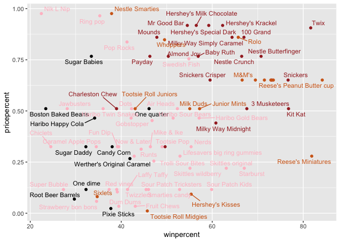
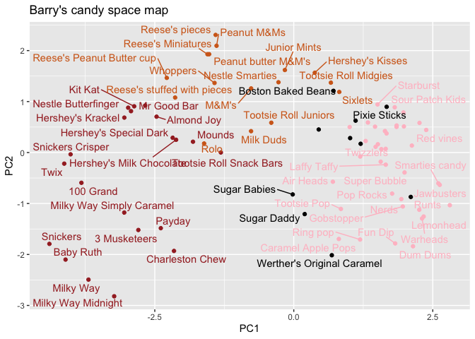

# Class 10: Halloween Mini Project
Maria Tavares (PID A69036242)

## Background

It’s Halloween tonight and to get in the mood let’s explore some candy
data.

## Data Import

``` r
candy_file <- "candy-data.csv"

candy <- read.csv(candy_file, row.names=1)
head(candy)
```

                 chocolate fruity caramel peanutyalmondy nougat crispedricewafer
    100 Grand            1      0       1              0      0                1
    3 Musketeers         1      0       0              0      1                0
    One dime             0      0       0              0      0                0
    One quarter          0      0       0              0      0                0
    Air Heads            0      1       0              0      0                0
    Almond Joy           1      0       0              1      0                0
                 hard bar pluribus sugarpercent pricepercent winpercent
    100 Grand       0   1        0        0.732        0.860   66.97173
    3 Musketeers    0   1        0        0.604        0.511   67.60294
    One dime        0   0        0        0.011        0.116   32.26109
    One quarter     0   0        0        0.011        0.511   46.11650
    Air Heads       0   0        0        0.906        0.511   52.34146
    Almond Joy      0   1        0        0.465        0.767   50.34755

``` r
flextable::flextable(head(candy))
```


## Favorite Candy

> Q1. How many different candy types are in this dataset?

``` r
nrow(candy)
```

    [1] 85

> Q2. How many fruity candy types are in the dataset?

``` r
sum(candy$fruity)
```

    [1] 38

``` r
candy["Twix", ]$winpercent
```

    [1] 81.64291

> Q3. What is your favorite candy in the dataset and what is it’s
> winpercent value?

``` r
candy["Reese's Peanut Butter cup", ]$winpercent
```

    [1] 84.18029

> Q4. What is the winpercent value for “Kit Kat”?

``` r
candy["Kit Kat", ]$winpercent
```

    [1] 76.7686

> Q5. What is the winpercent value for “Tootsie Roll Snack Bars”?

``` r
candy["Tootsie Roll Snack Bars", ]$winpercent
```

    [1] 49.6535

``` r
library("skimr")
skim(candy)
```

|                                                  |       |
|:-------------------------------------------------|:------|
| Name                                             | candy |
| Number of rows                                   | 85    |
| Number of columns                                | 12    |
| \_\_\_\_\_\_\_\_\_\_\_\_\_\_\_\_\_\_\_\_\_\_\_   |       |
| Column type frequency:                           |       |
| numeric                                          | 12    |
| \_\_\_\_\_\_\_\_\_\_\_\_\_\_\_\_\_\_\_\_\_\_\_\_ |       |
| Group variables                                  | None  |

Data summary

**Variable type: numeric**

| skim_variable | n_missing | complete_rate | mean | sd | p0 | p25 | p50 | p75 | p100 | hist |
|:---|---:|---:|---:|---:|---:|---:|---:|---:|---:|:---|
| chocolate | 0 | 1 | 0.44 | 0.50 | 0.00 | 0.00 | 0.00 | 1.00 | 1.00 | ▇▁▁▁▆ |
| fruity | 0 | 1 | 0.45 | 0.50 | 0.00 | 0.00 | 0.00 | 1.00 | 1.00 | ▇▁▁▁▆ |
| caramel | 0 | 1 | 0.16 | 0.37 | 0.00 | 0.00 | 0.00 | 0.00 | 1.00 | ▇▁▁▁▂ |
| peanutyalmondy | 0 | 1 | 0.16 | 0.37 | 0.00 | 0.00 | 0.00 | 0.00 | 1.00 | ▇▁▁▁▂ |
| nougat | 0 | 1 | 0.08 | 0.28 | 0.00 | 0.00 | 0.00 | 0.00 | 1.00 | ▇▁▁▁▁ |
| crispedricewafer | 0 | 1 | 0.08 | 0.28 | 0.00 | 0.00 | 0.00 | 0.00 | 1.00 | ▇▁▁▁▁ |
| hard | 0 | 1 | 0.18 | 0.38 | 0.00 | 0.00 | 0.00 | 0.00 | 1.00 | ▇▁▁▁▂ |
| bar | 0 | 1 | 0.25 | 0.43 | 0.00 | 0.00 | 0.00 | 0.00 | 1.00 | ▇▁▁▁▂ |
| pluribus | 0 | 1 | 0.52 | 0.50 | 0.00 | 0.00 | 1.00 | 1.00 | 1.00 | ▇▁▁▁▇ |
| sugarpercent | 0 | 1 | 0.48 | 0.28 | 0.01 | 0.22 | 0.47 | 0.73 | 0.99 | ▇▇▇▇▆ |
| pricepercent | 0 | 1 | 0.47 | 0.29 | 0.01 | 0.26 | 0.47 | 0.65 | 0.98 | ▇▇▇▇▆ |
| winpercent | 0 | 1 | 50.32 | 14.71 | 22.45 | 39.14 | 47.83 | 59.86 | 84.18 | ▃▇▆▅▂ |

``` r
library(dplyr)

candy |> nrow()
```

    [1] 85

``` r
candy |> select(winpercent)
```

                                winpercent
    100 Grand                     66.97173
    3 Musketeers                  67.60294
    One dime                      32.26109
    One quarter                   46.11650
    Air Heads                     52.34146
    Almond Joy                    50.34755
    Baby Ruth                     56.91455
    Boston Baked Beans            23.41782
    Candy Corn                    38.01096
    Caramel Apple Pops            34.51768
    Charleston Chew               38.97504
    Chewey Lemonhead Fruit Mix    36.01763
    Chiclets                      24.52499
    Dots                          42.27208
    Dum Dums                      39.46056
    Fruit Chews                   43.08892
    Fun Dip                       39.18550
    Gobstopper                    46.78335
    Haribo Gold Bears             57.11974
    Haribo Happy Cola             34.15896
    Haribo Sour Bears             51.41243
    Haribo Twin Snakes            42.17877
    Hershey's Kisses              55.37545
    Hershey's Krackel             62.28448
    Hershey's Milk Chocolate      56.49050
    Hershey's Special Dark        59.23612
    Jawbusters                    28.12744
    Junior Mints                  57.21925
    Kit Kat                       76.76860
    Laffy Taffy                   41.38956
    Lemonhead                     39.14106
    Lifesavers big ring gummies   52.91139
    Peanut butter M&M's           71.46505
    M&M's                         66.57458
    Mike & Ike                    46.41172
    Milk Duds                     55.06407
    Milky Way                     73.09956
    Milky Way Midnight            60.80070
    Milky Way Simply Caramel      64.35334
    Mounds                        47.82975
    Mr Good Bar                   54.52645
    Nerds                         55.35405
    Nestle Butterfinger           70.73564
    Nestle Crunch                 66.47068
    Nik L Nip                     22.44534
    Now & Later                   39.44680
    Payday                        46.29660
    Peanut M&Ms                   69.48379
    Pixie Sticks                  37.72234
    Pop Rocks                     41.26551
    Red vines                     37.34852
    Reese's Miniatures            81.86626
    Reese's Peanut Butter cup     84.18029
    Reese's pieces                73.43499
    Reese's stuffed with pieces   72.88790
    Ring pop                      35.29076
    Rolo                          65.71629
    Root Beer Barrels             29.70369
    Runts                         42.84914
    Sixlets                       34.72200
    Skittles original             63.08514
    Skittles wildberry            55.10370
    Nestle Smarties               37.88719
    Smarties candy                45.99583
    Snickers                      76.67378
    Snickers Crisper              59.52925
    Sour Patch Kids               59.86400
    Sour Patch Tricksters         52.82595
    Starburst                     67.03763
    Strawberry bon bons           34.57899
    Sugar Babies                  33.43755
    Sugar Daddy                   32.23100
    Super Bubble                  27.30386
    Swedish Fish                  54.86111
    Tootsie Pop                   48.98265
    Tootsie Roll Juniors          43.06890
    Tootsie Roll Midgies          45.73675
    Tootsie Roll Snack Bars       49.65350
    Trolli Sour Bites             47.17323
    Twix                          81.64291
    Twizzlers                     45.46628
    Warheads                      39.01190
    Welch's Fruit Snacks          44.37552
    Werther's Original Caramel    41.90431
    Whoppers                      49.52411

``` r
win <- candy$winpercent
win.mean <- mean(win)
round(win.mean)
```

    [1] 50

``` r
candy%>% select (winpercent)
```

                                winpercent
    100 Grand                     66.97173
    3 Musketeers                  67.60294
    One dime                      32.26109
    One quarter                   46.11650
    Air Heads                     52.34146
    Almond Joy                    50.34755
    Baby Ruth                     56.91455
    Boston Baked Beans            23.41782
    Candy Corn                    38.01096
    Caramel Apple Pops            34.51768
    Charleston Chew               38.97504
    Chewey Lemonhead Fruit Mix    36.01763
    Chiclets                      24.52499
    Dots                          42.27208
    Dum Dums                      39.46056
    Fruit Chews                   43.08892
    Fun Dip                       39.18550
    Gobstopper                    46.78335
    Haribo Gold Bears             57.11974
    Haribo Happy Cola             34.15896
    Haribo Sour Bears             51.41243
    Haribo Twin Snakes            42.17877
    Hershey's Kisses              55.37545
    Hershey's Krackel             62.28448
    Hershey's Milk Chocolate      56.49050
    Hershey's Special Dark        59.23612
    Jawbusters                    28.12744
    Junior Mints                  57.21925
    Kit Kat                       76.76860
    Laffy Taffy                   41.38956
    Lemonhead                     39.14106
    Lifesavers big ring gummies   52.91139
    Peanut butter M&M's           71.46505
    M&M's                         66.57458
    Mike & Ike                    46.41172
    Milk Duds                     55.06407
    Milky Way                     73.09956
    Milky Way Midnight            60.80070
    Milky Way Simply Caramel      64.35334
    Mounds                        47.82975
    Mr Good Bar                   54.52645
    Nerds                         55.35405
    Nestle Butterfinger           70.73564
    Nestle Crunch                 66.47068
    Nik L Nip                     22.44534
    Now & Later                   39.44680
    Payday                        46.29660
    Peanut M&Ms                   69.48379
    Pixie Sticks                  37.72234
    Pop Rocks                     41.26551
    Red vines                     37.34852
    Reese's Miniatures            81.86626
    Reese's Peanut Butter cup     84.18029
    Reese's pieces                73.43499
    Reese's stuffed with pieces   72.88790
    Ring pop                      35.29076
    Rolo                          65.71629
    Root Beer Barrels             29.70369
    Runts                         42.84914
    Sixlets                       34.72200
    Skittles original             63.08514
    Skittles wildberry            55.10370
    Nestle Smarties               37.88719
    Smarties candy                45.99583
    Snickers                      76.67378
    Snickers Crisper              59.52925
    Sour Patch Kids               59.86400
    Sour Patch Tricksters         52.82595
    Starburst                     67.03763
    Strawberry bon bons           34.57899
    Sugar Babies                  33.43755
    Sugar Daddy                   32.23100
    Super Bubble                  27.30386
    Swedish Fish                  54.86111
    Tootsie Pop                   48.98265
    Tootsie Roll Juniors          43.06890
    Tootsie Roll Midgies          45.73675
    Tootsie Roll Snack Bars       49.65350
    Trolli Sour Bites             47.17323
    Twix                          81.64291
    Twizzlers                     45.46628
    Warheads                      39.01190
    Welch's Fruit Snacks          44.37552
    Werther's Original Caramel    41.90431
    Whoppers                      49.52411

``` r
candy |> 
  select(winpercent)
```

                                winpercent
    100 Grand                     66.97173
    3 Musketeers                  67.60294
    One dime                      32.26109
    One quarter                   46.11650
    Air Heads                     52.34146
    Almond Joy                    50.34755
    Baby Ruth                     56.91455
    Boston Baked Beans            23.41782
    Candy Corn                    38.01096
    Caramel Apple Pops            34.51768
    Charleston Chew               38.97504
    Chewey Lemonhead Fruit Mix    36.01763
    Chiclets                      24.52499
    Dots                          42.27208
    Dum Dums                      39.46056
    Fruit Chews                   43.08892
    Fun Dip                       39.18550
    Gobstopper                    46.78335
    Haribo Gold Bears             57.11974
    Haribo Happy Cola             34.15896
    Haribo Sour Bears             51.41243
    Haribo Twin Snakes            42.17877
    Hershey's Kisses              55.37545
    Hershey's Krackel             62.28448
    Hershey's Milk Chocolate      56.49050
    Hershey's Special Dark        59.23612
    Jawbusters                    28.12744
    Junior Mints                  57.21925
    Kit Kat                       76.76860
    Laffy Taffy                   41.38956
    Lemonhead                     39.14106
    Lifesavers big ring gummies   52.91139
    Peanut butter M&M's           71.46505
    M&M's                         66.57458
    Mike & Ike                    46.41172
    Milk Duds                     55.06407
    Milky Way                     73.09956
    Milky Way Midnight            60.80070
    Milky Way Simply Caramel      64.35334
    Mounds                        47.82975
    Mr Good Bar                   54.52645
    Nerds                         55.35405
    Nestle Butterfinger           70.73564
    Nestle Crunch                 66.47068
    Nik L Nip                     22.44534
    Now & Later                   39.44680
    Payday                        46.29660
    Peanut M&Ms                   69.48379
    Pixie Sticks                  37.72234
    Pop Rocks                     41.26551
    Red vines                     37.34852
    Reese's Miniatures            81.86626
    Reese's Peanut Butter cup     84.18029
    Reese's pieces                73.43499
    Reese's stuffed with pieces   72.88790
    Ring pop                      35.29076
    Rolo                          65.71629
    Root Beer Barrels             29.70369
    Runts                         42.84914
    Sixlets                       34.72200
    Skittles original             63.08514
    Skittles wildberry            55.10370
    Nestle Smarties               37.88719
    Smarties candy                45.99583
    Snickers                      76.67378
    Snickers Crisper              59.52925
    Sour Patch Kids               59.86400
    Sour Patch Tricksters         52.82595
    Starburst                     67.03763
    Strawberry bon bons           34.57899
    Sugar Babies                  33.43755
    Sugar Daddy                   32.23100
    Super Bubble                  27.30386
    Swedish Fish                  54.86111
    Tootsie Pop                   48.98265
    Tootsie Roll Juniors          43.06890
    Tootsie Roll Midgies          45.73675
    Tootsie Roll Snack Bars       49.65350
    Trolli Sour Bites             47.17323
    Twix                          81.64291
    Twizzlers                     45.46628
    Warheads                      39.01190
    Welch's Fruit Snacks          44.37552
    Werther's Original Caramel    41.90431
    Whoppers                      49.52411

> Q6. Is there any variable/column that looks to be on a different scale
> to the majority of the other columns in the dataset?

`Winpercent` is 0 to 100 percent scale.

> Q7. What do you think a zero and one represent for the
> candy\$chocolate column?

Zero means it’s not chocolate and one means it is chocolate.

> Q8. Plot a histogram of winpercent values

``` r
library(ggplot2)
ggplot(candy) +
  aes(winpercent) +
  geom_histogram(bins = 20)
```


> Q9. Is the distribution of winpercent values symmetrical?

No, it is skewed.

``` r
ggplot(candy) +
  aes(winpercent) +
  geom_density()
```


> Q10. Is the center of the distribution above or below 50%?

Below.

``` r
mean(candy$winpercent)
```

    [1] 50.31676

``` r
summary(candy$winpercent)
```

       Min. 1st Qu.  Median    Mean 3rd Qu.    Max. 
      22.45   39.14   47.83   50.32   59.86   84.18 

> Q11. On average is chocolate candy higher or lower ranked than fruit
> candy?

``` r
# 1. Find the chocolate candy in the dataset
choc.inds <- as.logical(candy$chocolate) 
choc.inds
```

     [1]  TRUE  TRUE FALSE FALSE FALSE  TRUE  TRUE FALSE FALSE FALSE  TRUE FALSE
    [13] FALSE FALSE FALSE FALSE FALSE FALSE FALSE FALSE FALSE FALSE  TRUE  TRUE
    [25]  TRUE  TRUE FALSE  TRUE  TRUE FALSE FALSE FALSE  TRUE  TRUE FALSE  TRUE
    [37]  TRUE  TRUE  TRUE  TRUE  TRUE FALSE  TRUE  TRUE FALSE FALSE FALSE  TRUE
    [49] FALSE FALSE FALSE  TRUE  TRUE  TRUE  TRUE FALSE  TRUE FALSE FALSE  TRUE
    [61] FALSE FALSE  TRUE FALSE  TRUE  TRUE FALSE FALSE FALSE FALSE FALSE FALSE
    [73] FALSE FALSE  TRUE  TRUE  TRUE  TRUE FALSE  TRUE FALSE FALSE FALSE FALSE
    [85]  TRUE

``` r
choc.candy <- candy[choc.inds,]

# 2. Extract their meanpercent values 
choc.win <- choc.candy$winpercent

# 3. Find the mean of these values 
mean (choc.win)
```

    [1] 60.92153

``` r
# 4-6. Do the same for fruity candy
fruity.inds <- as.logical(candy$fruity) 
fruity.inds
```

     [1] FALSE FALSE FALSE FALSE  TRUE FALSE FALSE FALSE FALSE  TRUE FALSE  TRUE
    [13]  TRUE  TRUE  TRUE  TRUE  TRUE  TRUE  TRUE FALSE  TRUE  TRUE FALSE FALSE
    [25] FALSE FALSE  TRUE FALSE FALSE  TRUE  TRUE  TRUE FALSE FALSE  TRUE FALSE
    [37] FALSE FALSE FALSE FALSE FALSE  TRUE FALSE FALSE  TRUE  TRUE FALSE FALSE
    [49] FALSE  TRUE  TRUE FALSE FALSE FALSE FALSE  TRUE FALSE FALSE  TRUE FALSE
    [61]  TRUE  TRUE FALSE  TRUE FALSE FALSE  TRUE  TRUE  TRUE  TRUE FALSE FALSE
    [73]  TRUE  TRUE  TRUE FALSE FALSE FALSE  TRUE FALSE  TRUE  TRUE  TRUE FALSE
    [85] FALSE

``` r
fruity.candy <- candy[fruity.inds,]
fruity.win <- fruity.candy$winpercent
mean(fruity.win)
```

    [1] 44.11974

``` r
# 7. Which mean value is higher 
mean(choc.win) > mean(fruity.win)
```

    [1] TRUE

> Q12. Is this difference statistically significant?

``` r
t.test(choc.win, fruity.win)
```


        Welch Two Sample t-test

    data:  choc.win and fruity.win
    t = 6.2582, df = 68.882, p-value = 2.871e-08
    alternative hypothesis: true difference in means is not equal to 0
    95 percent confidence interval:
     11.44563 22.15795
    sample estimates:
    mean of x mean of y 
     60.92153  44.11974 

## Overall Candy Rating

> Q13. What are the five least liked candy types in this set?

``` r
candy %>% arrange(winpercent) %>% head(5)
```

                       chocolate fruity caramel peanutyalmondy nougat
    Nik L Nip                  0      1       0              0      0
    Boston Baked Beans         0      0       0              1      0
    Chiclets                   0      1       0              0      0
    Super Bubble               0      1       0              0      0
    Jawbusters                 0      1       0              0      0
                       crispedricewafer hard bar pluribus sugarpercent pricepercent
    Nik L Nip                         0    0   0        1        0.197        0.976
    Boston Baked Beans                0    0   0        1        0.313        0.511
    Chiclets                          0    0   0        1        0.046        0.325
    Super Bubble                      0    0   0        0        0.162        0.116
    Jawbusters                        0    1   0        1        0.093        0.511
                       winpercent
    Nik L Nip            22.44534
    Boston Baked Beans   23.41782
    Chiclets             24.52499
    Super Bubble         27.30386
    Jawbusters           28.12744

``` r
ord.ind <- order(candy$winpercent)
head(candy[order(candy$winpercent),], n=5)
```

                       chocolate fruity caramel peanutyalmondy nougat
    Nik L Nip                  0      1       0              0      0
    Boston Baked Beans         0      0       0              1      0
    Chiclets                   0      1       0              0      0
    Super Bubble               0      1       0              0      0
    Jawbusters                 0      1       0              0      0
                       crispedricewafer hard bar pluribus sugarpercent pricepercent
    Nik L Nip                         0    0   0        1        0.197        0.976
    Boston Baked Beans                0    0   0        1        0.313        0.511
    Chiclets                          0    0   0        1        0.046        0.325
    Super Bubble                      0    0   0        0        0.162        0.116
    Jawbusters                        0    1   0        1        0.093        0.511
                       winpercent
    Nik L Nip            22.44534
    Boston Baked Beans   23.41782
    Chiclets             24.52499
    Super Bubble         27.30386
    Jawbusters           28.12744

> Q14. What are the top 5 all time favorite candy types out of this set?

``` r
candy %>% arrange(winpercent) %>% tail(5)
```

                              chocolate fruity caramel peanutyalmondy nougat
    Snickers                          1      0       1              1      1
    Kit Kat                           1      0       0              0      0
    Twix                              1      0       1              0      0
    Reese's Miniatures                1      0       0              1      0
    Reese's Peanut Butter cup         1      0       0              1      0
                              crispedricewafer hard bar pluribus sugarpercent
    Snickers                                 0    0   1        0        0.546
    Kit Kat                                  1    0   1        0        0.313
    Twix                                     1    0   1        0        0.546
    Reese's Miniatures                       0    0   0        0        0.034
    Reese's Peanut Butter cup                0    0   0        0        0.720
                              pricepercent winpercent
    Snickers                         0.651   76.67378
    Kit Kat                          0.511   76.76860
    Twix                             0.906   81.64291
    Reese's Miniatures               0.279   81.86626
    Reese's Peanut Butter cup        0.651   84.18029

``` r
tail(candy[order(candy$winpercent),], n=5)
```

                              chocolate fruity caramel peanutyalmondy nougat
    Snickers                          1      0       1              1      1
    Kit Kat                           1      0       0              0      0
    Twix                              1      0       1              0      0
    Reese's Miniatures                1      0       0              1      0
    Reese's Peanut Butter cup         1      0       0              1      0
                              crispedricewafer hard bar pluribus sugarpercent
    Snickers                                 0    0   1        0        0.546
    Kit Kat                                  1    0   1        0        0.313
    Twix                                     1    0   1        0        0.546
    Reese's Miniatures                       0    0   0        0        0.034
    Reese's Peanut Butter cup                0    0   0        0        0.720
                              pricepercent winpercent
    Snickers                         0.651   76.67378
    Kit Kat                          0.511   76.76860
    Twix                             0.906   81.64291
    Reese's Miniatures               0.279   81.86626
    Reese's Peanut Butter cup        0.651   84.18029

> Q15. Make a first barplot of candy ranking based on winpercent values.

``` r
ggplot(candy) +
  aes(winpercent, rownames(candy), winpercent) +
  geom_col() 
```


> Q16. This is quite ugly, use the reorder() function to get the bars
> sorted by winpercent?

``` r
ggplot(candy) +
  aes(winpercent, reorder(rownames(candy), winpercent)) +
  geom_col() 
```


Add some color

``` r
my_cols=rep("black", nrow(candy))
my_cols[as.logical(candy$chocolate)] = "chocolate"
my_cols[as.logical(candy$bar)] = "brown"
my_cols[as.logical(candy$fruity)] = "pink"


ggplot(candy) +
  aes(x=winpercent, 
      y=reorder(rownames(candy), winpercent)) +
  geom_col(fill=my_cols) 
```


Now, for the first time, using this plot we can answer questions like:
\> Q17. What is the worst ranked chocolate candy?

Nik L Nip

> Q18. What is the best ranked fruity candy?

Reese’s Peanut Butter Cup

## Price percent

``` r
library(ggrepel)

# How about a plot of price vs win
ggplot(candy) +
  aes(winpercent, pricepercent, label=rownames(candy)) +
  geom_point(col=my_cols) + 
  geom_text_repel(col=my_cols, size=3.3, max.overlaps = 10)
```

    Warning: ggrepel: 10 unlabeled data points (too many overlaps). Consider
    increasing max.overlaps



> Q19. Which candy type is the highest ranked in terms of winpercent for
> the least money - i.e. offers the most bang for your buck?

Reese’s Miniatures

> Q20. What are the top 5 most expensive candy types in the dataset and
> of these which is the least popular?

``` r
ord <- order(candy$pricepercent, decreasing = TRUE)
head( candy[ord,c(11,12)], n=5 )
```

                             pricepercent winpercent
    Nik L Nip                       0.976   22.44534
    Nestle Smarties                 0.976   37.88719
    Ring pop                        0.965   35.29076
    Hershey's Krackel               0.918   62.28448
    Hershey's Milk Chocolate        0.918   56.49050

## Correlation

``` r
cij <- cor(candy)
```

``` r
library(corrplot)
```

    corrplot 0.95 loaded

``` r
corrplot(cij)
```


> Q22. Examining this plot what two variables are anti-correlated
> (i.e. have minus values)?

chocolate & fruity

> Q23. Similarly, what two variables are most positively correlated?

chocolate & winpercent

## PCA

Let’s apply PCA using the `prcom()` function to our candy dataset
remembering to set the `scale=TRUE` argument

``` r
pca <- prcomp(candy, scale=TRUE)
summary(pca)
```

    Importance of components:
                              PC1    PC2    PC3     PC4    PC5     PC6     PC7
    Standard deviation     2.0788 1.1378 1.1092 1.07533 0.9518 0.81923 0.81530
    Proportion of Variance 0.3601 0.1079 0.1025 0.09636 0.0755 0.05593 0.05539
    Cumulative Proportion  0.3601 0.4680 0.5705 0.66688 0.7424 0.79830 0.85369
                               PC8     PC9    PC10    PC11    PC12
    Standard deviation     0.74530 0.67824 0.62349 0.43974 0.39760
    Proportion of Variance 0.04629 0.03833 0.03239 0.01611 0.01317
    Cumulative Proportion  0.89998 0.93832 0.97071 0.98683 1.00000

``` r
ggplot(pca$x) +
  aes(PC1, PC2, label = rownames(pca$x)) +
  geom_point(col=my_cols) +
  geom_text_repel(col=my_cols) +
  labs(title="Barry's candy space map")
```

    Warning: ggrepel: 24 unlabeled data points (too many overlaps). Consider
    increasing max.overlaps



Don’t forget about your variable “loadings” - how the original variables
contribute to your new pcs

``` r
ggplot(pca$rotation) +
  aes(PC1, rownames(pca$rotation))+
  geom_col()
```


> Q24. What original variables are picked up strongly by PC1 in the
> positive direction? Do these make sense to you?

Pluribus, hard, and fruity. It makes sense because the fruity candles
usually are harder than chocolate and come in packages with multiple
(like skittles, starburst).
