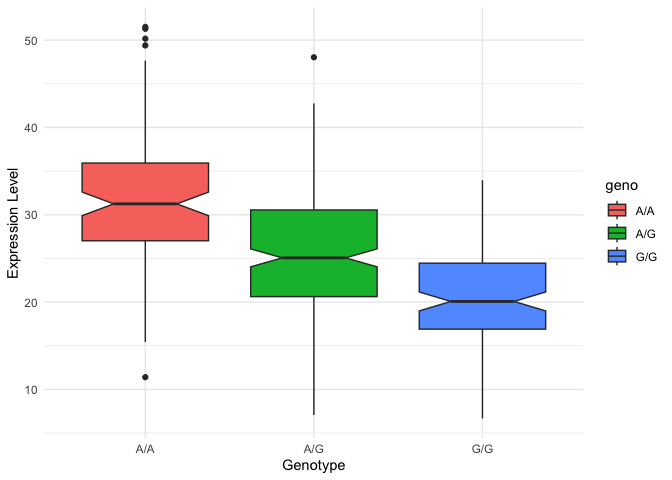

# Class 17: Genome Informatics
Maria Tavares

``` r
library(tidyverse)
```

    ── Attaching core tidyverse packages ──────────────────────── tidyverse 2.0.0 ──
    ✔ dplyr     1.1.4     ✔ readr     2.1.5
    ✔ forcats   1.0.1     ✔ stringr   1.6.0
    ✔ ggplot2   4.0.0     ✔ tibble    3.3.0
    ✔ lubridate 1.9.4     ✔ tidyr     1.3.1
    ✔ purrr     1.2.0     
    ── Conflicts ────────────────────────────────────────── tidyverse_conflicts() ──
    ✖ dplyr::filter() masks stats::filter()
    ✖ dplyr::lag()    masks stats::lag()
    ℹ Use the conflicted package (<http://conflicted.r-lib.org/>) to force all conflicts to become errors

``` r
library(ggplot2)
library(readr)
```

``` r
galaxy_data <- read.table("rs8067378_ENSG00000172057.6.txt")
```

> Q13: Read this file into R and determine the sample size for each
> genotype and their corresponding median expression levels for each of
> these genotypes.

``` r
galaxy_data |>
  group_by(geno) |>
  summarize(
    Sample_Size = n(),
    Median_Expression = median(exp)
  )
```

    # A tibble: 3 × 3
      geno  Sample_Size Median_Expression
      <chr>       <int>             <dbl>
    1 A/A           108              31.2
    2 A/G           233              25.1
    3 G/G           121              20.1

> Q14: Generate a boxplot with a box per genotype, what could you infer
> from the relative expression value between A/A and G/G displayed in
> this plot? Does the SNP effect the expression of ORMDL3?

ORMDL3 expression is highest in individuals with the A/A genotype and
lowest in those with the G/G genotype. This suggests that the SNP
affects ORMDL3 expression, with the G allele associated with reduced
expression in a dose-dependent manner.

``` r
ggplot(galaxy_data) +
  geom_boxplot(aes(x = geno, y = exp, fill = geno, notch=TRUE)) +
  labs(
    x = "Genotype",
    y = "Expression Level"
 
)+ theme_minimal()
```

    Warning in geom_boxplot(aes(x = geno, y = exp, fill = geno, notch = TRUE)):
    Ignoring unknown aesthetics: notch


